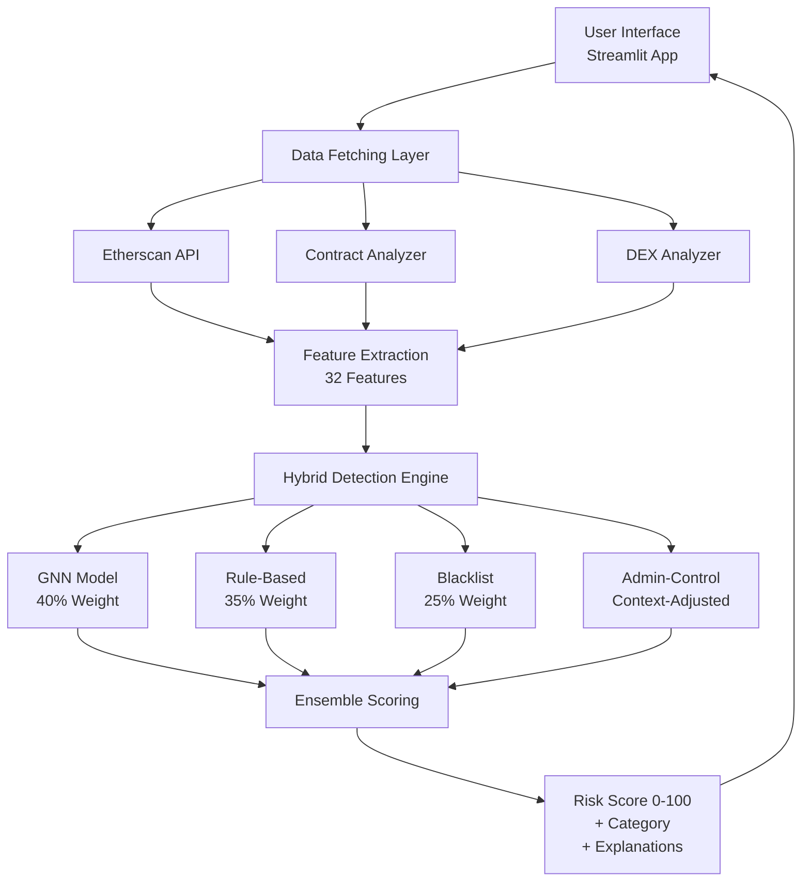
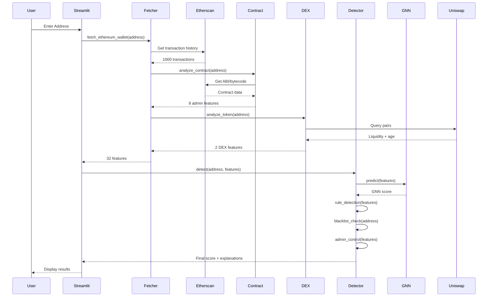
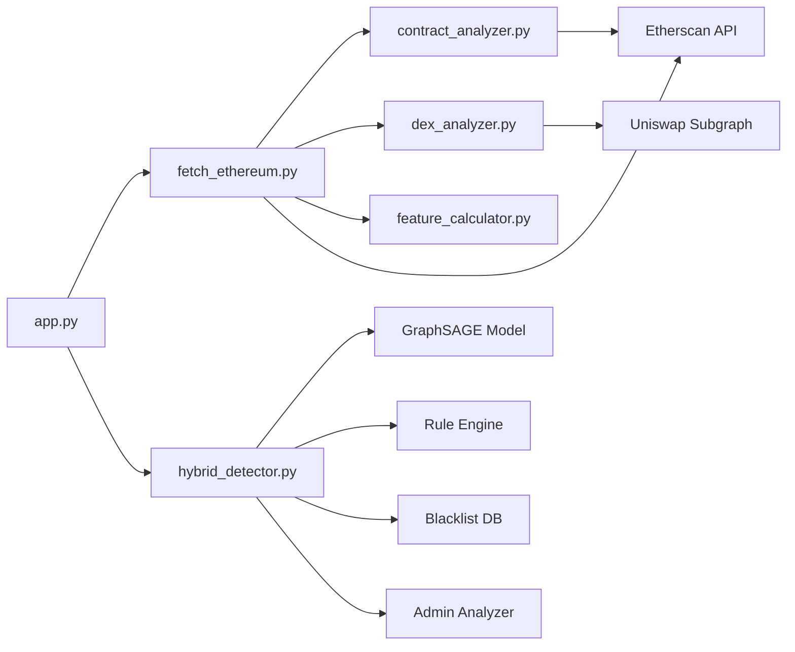
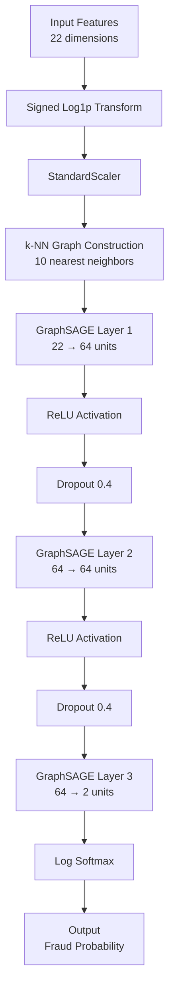
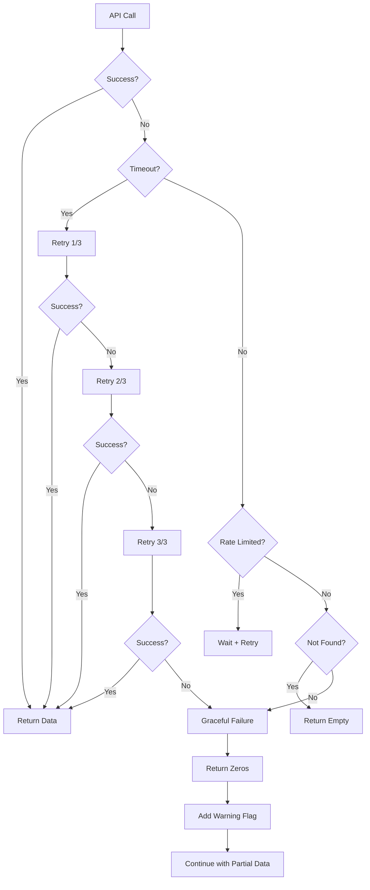
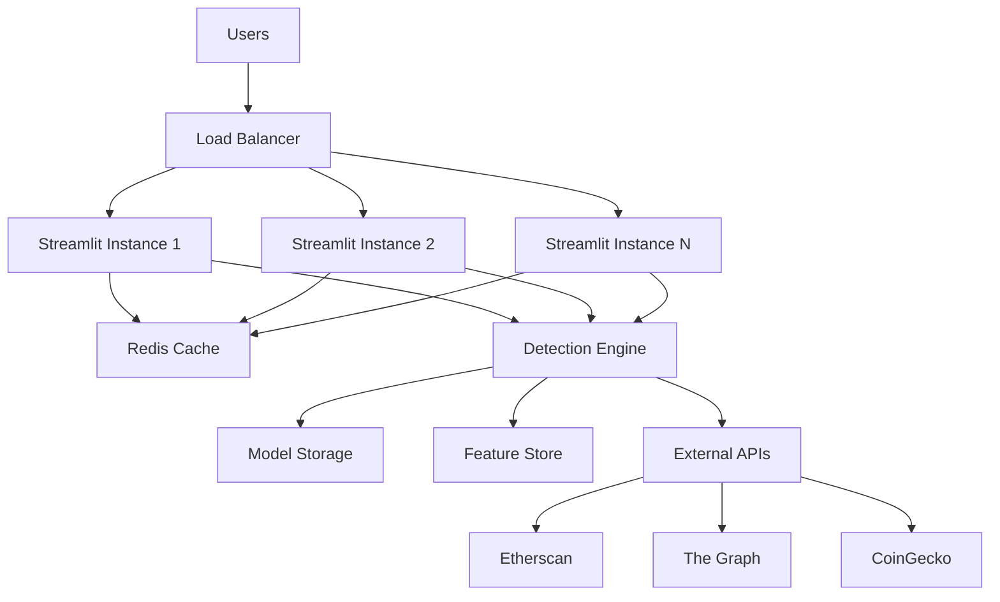

# System Architecture

## Overview Architecture



## Detailed Component Flow



## Module Dependencies



## Data Flow

### 1. Input Layer
```
User Address (0x...)
    ↓
Validation
    ↓
Blockchain Detection (Ethereum/Solana/etc)
```

### 2. Data Collection Layer
```
┌─────────────────────────────────────┐
│  fetch_ethereum_wallet(address)     │
├─────────────────────────────────────┤
│                                     │
│  ┌──────────────────────────────┐  │
│  │ Transaction History          │  │
│  │ - Etherscan API              │  │
│  │ - 1000 latest transactions   │  │
│  │ → 22 features                │  │
│  └──────────────────────────────┘  │
│                                     │
│  ┌──────────────────────────────┐  │
│  │ Contract Analysis            │  │
│  │ - ABI parsing                │  │
│  │ - Bytecode analysis          │  │
│  │ → 8 features                 │  │
│  └──────────────────────────────┘  │
│                                     │
│  ┌──────────────────────────────┐  │
│  │ DEX Data                     │  │
│  │ - Uniswap V2 subgraph        │  │
│  │ - Liquidity + pair age       │  │
│  │ → 2 features                 │  │
│  └──────────────────────────────┘  │
│                                     │
│  Total: 32 features                 │
└─────────────────────────────────────┘
```

### 3. Feature Extraction Layer
```
Transaction Features (22):
├── Sent tnx
├── Received Tnx
├── Unique Sent To Addresses
├── Unique Received From Addresses
├── total Ether sent
├── total ether received
├── total ether balance
├── avg val sent
├── avg val received
├── Time Diff between first and last (Mins)
└── ... (12 more)

Contract Features (8):
├── can_mint
├── has_blacklist
├── can_pause
├── fee_too_high
├── has_trading_limits
├── has_trading_cooldown
├── owner_can_withdraw
└── owner_change_balance

DEX Features (2):
├── total_liquidity_usd
└── pair_created_days
```

### 4. Detection Layer
```
┌────────────────────────────────────────┐
│         Hybrid Detector                │
├────────────────────────────────────────┤
│                                        │
│  ┌──────────────────────────────────┐ │
│  │ GNN Model (40% weight)           │ │
│  │ ├── Build k-NN graph (10 nodes)  │ │
│  │ ├── GraphSAGE inference          │ │
│  │ └── Output: 0-100 score          │ │
│  └──────────────────────────────────┘ │
│              │                         │
│              ▼                         │
│  ┌──────────────────────────────────┐ │
│  │ Rule-Based (35% weight)          │ │
│  │ ├── 9 fraud patterns             │ │
│  │ ├── Statistical thresholds       │ │
│  │ └── Output: 0-100 score          │ │
│  └──────────────────────────────────┘ │
│              │                         │
│              ▼                         │
│  ┌──────────────────────────────────┐ │
│  │ Blacklist (25% weight)           │ │
│  │ ├── 8+ known scams               │ │
│  │ ├── Exact address match          │ │
│  │ └── Output: 0 or 100             │ │
│  └──────────────────────────────────┘ │
│              │                         │
│              ▼                         │
│  ┌──────────────────────────────────┐ │
│  │ Admin-Control (30% additional)   │ │
│  │ ├── Detect 8 admin powers        │ │
│  │ ├── Context adjustment:          │ │
│  │ │   - New: multiplier 1.0        │ │
│  │ │   - Established: mult. 0.25    │ │
│  │ └── Output: 0-100 score          │ │
│  └──────────────────────────────────┘ │
│              │                         │
│              ▼                         │
│  ┌──────────────────────────────────┐ │
│  │ Weighted Ensemble                │ │
│  │ final = 0.4*GNN + 0.35*Rules     │ │
│  │       + 0.25*Blacklist           │ │
│  │       + 0.3*Admin (adjusted)     │ │
│  └──────────────────────────────────┘ │
│              │                         │
└──────────────┼─────────────────────────┘
               ▼
     Risk Score (0-100)
     + Category (Low/Medium/High)
     + Explanations (list)
```

### 5. Output Layer
```
┌────────────────────────────────┐
│  Risk Assessment               │
├────────────────────────────────┤
│  Score: 70/100                 │
│  Category: High Risk           │
│                                │
│  Explanations:                 │
│  🚨 BLACKLIST: Fake_Phishing   │
│  📊 Send ratio: 9.9x           │
│  🎯 Sends to 188 addresses     │
│  💸 Value asymmetry: 14x       │
└────────────────────────────────┘
```

## GNN Architecture



### GNN Training Details
- **Architecture:** GraphSAGE (Hamilton et al., 2017)
- **Input:** 22 transaction features
- **Hidden layers:** 2 × 64 units
- **Output:** 2 classes (legitimate, fraud)
- **Dropout:** 0.4
- **Activation:** ReLU
- **Loss:** Negative Log Likelihood
- **Optimizer:** Adam
- **Learning rate:** 0.001
- **Epochs:** 50 (early stopping)
- **Training data:** 5,944 wallets
- **Test data:** 1,486 wallets
- **F1 Score:** 80.6%

## Rule-Based Detection Logic

```
IF send_receive_ratio > 8:
    risk += 35  # Scam pattern
ELIF send_receive_ratio > 5:
    risk += 25  # High send ratio

IF unique_sent_to > 150:
    risk += 30  # Distribution pattern
ELIF unique_sent_to > 100:
    risk += 20  # Wide distribution

IF dispersion_ratio > 5:
    risk += 25  # High dispersion
ELIF dispersion_ratio > 3:
    risk += 15  # Moderate dispersion

IF total_received > 1 AND balance < 0.01:
    risk += 30  # Drained wallet
ELIF total_received > 10 AND balance < 5%:
    risk += 20  # Low balance

IF sent > 100 AND avg_sent < 0.1:
    risk += 20  # Micro-distribution

IF lifetime < 24hrs AND total_received > 10 AND balance < 0.1:
    risk += 30  # Quick flip

IF unique_received > 50 AND unique_sent < 10 AND avg_sent > 10*avg_received:
    risk += 25  # Consolidation

IF sent + received > 500 AND imbalance > 70%:
    risk += 20  # Volume imbalance

IF avg_received/avg_sent > 10 AND sent > received:
    risk += 25  # Value asymmetry (phishing)

RETURN min(risk, 100)
```

## Admin-Control Context Logic

```
# Step 1: Detect admin powers (raw score)
raw_score = 0
IF can_mint: raw_score += 15
IF has_blacklist: raw_score += 15
IF can_pause: raw_score += 12
IF fee_too_high: raw_score += 10
IF has_trading_limits: raw_score += 8
IF has_trading_cooldown: raw_score += 12
IF owner_can_withdraw: raw_score += 18
IF owner_change_balance: raw_score += 10

# Step 2: Check if established
is_established = (
    liquidity_usd >= 5_000_000 AND
    pair_age_days >= 365
)

# Step 3: Apply context adjustment
IF is_established:
    adjusted_score = raw_score * 0.25  # 75% reduction
    reason = "Established token: admin powers common"
ELSE:
    adjusted_score = raw_score  # Full penalty
    reason = "New/small token: admin powers risky"

RETURN adjusted_score, reason
```

## Error Handling Flow



## Caching Strategy

```
┌─────────────────────────────────────┐
│  In-Memory Cache                    │
├─────────────────────────────────────┤
│  contract_analyzer.cache            │
│  └── address → features (24hr TTL) │
│                                     │
│  dex_analyzer.cache                 │
│  └── address → DEX data (1hr TTL)  │
└─────────────────────────────────────┘
```

## Performance Characteristics

| Component | Latency | Cacheability |
|-----------|---------|-------------|
| Etherscan API | 2-3 sec | No (live data) |
| Contract Analysis | 2-3 sec | Yes (24 hrs) |
| DEX Query | 1-2 sec | Yes (1 hr) |
| Feature Computation | <1 sec | No |
| GNN Inference | <1 sec | No |
| Rule Detection | <1 sec | No |
| **Total** | **5-10 sec** | - |

## Scalability Considerations

### Current (Single User)
- **Throughput:** 1 request per 5-10 seconds
- **Bottleneck:** Etherscan API (rate limited)
- **Concurrent users:** 1

### Production (Multiple Users)
- **Required:** Redis caching layer
- **Required:** Paid Etherscan API (100K req/day)
- **Required:** Load balancer
- **Expected throughput:** 10-50 requests/second
- **Expected concurrent users:** 100-1000

## Technology Stack

```
Frontend:
└── Streamlit 1.28+

Backend:
├── Python 3.11
├── PyTorch 2.0+
├── PyTorch Geometric 2.4+
└── scikit-learn 1.3+

APIs:
├── Etherscan V2 API
├── The Graph (Uniswap)
└── CoinGecko (price data)

Storage:
├── Model: .pt files (PyTorch)
├── Scaler: .pkl files (pickle)
└── Data: .csv, .pt files

Testing:
├── pytest (unit tests)
├── pandas (data validation)
└── Custom test runner
```

## Security Measures

1. **Input Validation**
   - Address format checking
   - EIP-55 checksum validation
   - Length validation

2. **API Security**
   - API keys in .env (not committed)
   - Rate limiting respect
   - Timeout handling

3. **Data Validation**
   - Feature range checking
   - Type validation
   - Outlier detection

4. **Error Handling**
   - Graceful degradation
   - User-friendly error messages
   - Logging for debugging

## Deployment Architecture (Future)



---

## References

- **GraphSAGE:** Hamilton et al., "Inductive Representation Learning on Large Graphs", NeurIPS 2017
- **Elliptic Dataset:** Weber et al., "Anti-Money Laundering in Bitcoin", 2019
- **PyTorch Geometric:** Fey & Lenssen, "Fast Graph Representation Learning", 2019

---

**Last Updated:** Phase 3 Complete
